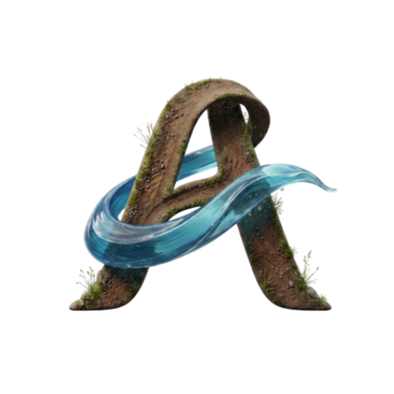

# Audtheia V2

[](LICENSE)
[](https://www.python.org/downloads/)
[](#system-requirements)
[](#why-it-exists)
[](docs/hardware.md)
[](CHANGELOG.md)
[](https://github.com/AudtheiaOfficial/audtheia-v2/wiki)

<!-- These live GitHub badges render once the repository is public (they read counts from the
     GitHub API, which cannot see a private repo). Uncomment them at publish:
[](https://github.com/AudtheiaOfficial/audtheia-v2/stargazers)
[](https://github.com/AudtheiaOfficial/audtheia-v2/network/members)
[](https://github.com/AudtheiaOfficial/audtheia-v2/issues)
-->


<div align="center">



### Fully offline environmental intelligence for the field

</div>

**A fully offline environmental-intelligence platform for biodiversity monitoring, Marine Protected Area designation support, and longitudinal pattern discovery.**

Audtheia V2 runs on an ordinary personal computer and, when you want a field deployment, connects to one or more Raspberry Pi 5 field stations with a Hailo AI accelerator, deployed in marine, terrestrial, estuarine, or freshwater sites. Once set up, **no internet connection is required at runtime.** A camera or a hydrophone, a field station, and the desktop application are enough to run a rigorous, structured monitoring pipeline anywhere, including the remote, hard-to-reach places where continuous observation is least practical and most needed.

You can also run the entire platform on a single computer with no field hardware at all. That makes it easy to try, to teach with, to compare methods, and to analyze recorded footage, before or instead of building a station.

---

## Two ways to run Audtheia

Audtheia runs the same pipeline in two deployments. Choose the one that fits what you have.

| | Desktop hardware-free mode | Field station |
|---|---|---|
| Where it runs | Any personal computer | A Raspberry Pi 5 in the field, plus your computer as the hub |
| What it watches | A webcam, a network or web-page stream, or a video file | A dedicated camera and, for marine sites, a hydrophone, at a fixed location |
| Detection model | An RF-DETR model (Apache-2.0) run through ONNX Runtime | A detector you train and compile to the accelerator |
| Power | Wall power | Solar and battery, or wall power near shore |
| Best for | Trying the system, teaching, comparing methods, analyzing recordings | Real longitudinal field studies and Marine Protected Area work |

In both modes, detection triggers a complete multimodal observation, quality control finalizes it, the desktop verifies and runs a longitudinal analysis over the record, and reports are generated with every value labeled by its provenance. The field station simply adds real sensors and real, unattended deployment.

## Why it exists

Some of the ecosystems most worth protecting are the hardest to watch. Field sites can be remote, difficult to access, or demand around-the-clock observation that no small team can sustain in person. Audtheia was built to close that gap: to give a single researcher, a classroom, a small organization, or a protected-area manager the kind of continuous, defensible monitoring that normally takes a full team on site.

It does that without asking you to give up control of your data. Everything runs on hardware you own. Observations live in a local database on your own computer; nothing is sent to a cloud service, and no credentials leave your machine. The detection code, the analysis code, the database schema, and the desktop application are released under the MIT license, so anyone can deploy it, adapt it to their own species and sites, or build on it.

## Who it is for

Audtheia is built for people who need a defensible ecological record but do not have a data-engineering team behind them. Everything a study needs is reachable from the interface, so no programming is required to run it.

- **Field researchers and graduate students** running longitudinal studies at sites that are remote, hard to reach, or simply too demanding to watch by hand around the clock.
- **Marine Protected Area managers** who need continuous, provenance-labeled evidence to support designation, evaluation, and reporting.
- **Small conservation organizations** that want research-grade monitoring without a cloud subscription or a standing compute budget.
- **Educators and classrooms** using the desktop hardware-free mode to teach detection, verification, and the difference between a measurement and an inference.
- **Anyone re-analyzing recorded footage**, comparing methods, or building a baseline before committing to field hardware.

Typical uses include coral-reef and benthic monitoring, marine megafauna and fish surveys, bird phenology and acoustic monitoring, estuarine and freshwater biodiversity work, and endangered-species presence tracking with conservation status attached to each observation.

## How it works

**Detection is the trigger for everything.** A camera streams continuously into a detection model, which screens every frame it can. Nothing is captured on a timer. When the model sees something, or when the acoustic stream hears something, that moment becomes an **event**:

- an object tracker collapses the detected animal across consecutive frames into one event, never one row per frame;
- the event simultaneously captures audio, reads the GPS and every configured environmental sensor, and queries the offline GBIF taxonomic backbone;
- one provenance-tagged, multimodal observation is written to the local database.

The desktop hub does the heavy, high-accuracy work: it re-verifies every detection with a second, larger model (RF-DETR through ONNX Runtime), owns all ecological interpretation, runs a longitudinal pattern-discovery pass over the verified record, generates reports, and holds the authoritative database. **Only reports and the pattern pass run on a schedule;** everything else is driven by what actually happens in front of the sensor.

## The scientific guarantee

What makes Audtheia's data trustworthy is not a metaphor; it is bookkeeping, enforced at the database level. Every value the system stores carries a provenance tag and a quality-control status. A number a sensor measured, a value looked up from a reference database, a model's classification, an interpretation inferred downstream, and a candidate pattern proposed by the longitudinal pass all remain permanently distinguishable. The database makes it structurally impossible to blur measured fact with inference. Marine sensor channels additionally carry the standard oceanographic quality flags. Interpretation and pattern discovery live on the far side of that firewall, always labeled, always traceable back to the confirmed detections that produced them. The goal is a research-grade, FAIR-defensible record a scientist can stand behind.

---

## System requirements

**Desktop hub (required).** Any reasonably modern computer running Windows, macOS, or Linux, with Python 3.11 or newer. No GPU is required: the desktop verifier runs on ONNX Runtime and works on the CPU, though a supported GPU speeds it up. Allow several gigabytes of free disk for the offline GBIF taxonomic backbone and the models, which setup downloads once. After setup, no internet connection is needed to run the platform; a network is used only to reach a field station and, at setup time, to fetch species reference data.

**Field station (optional).** A Raspberry Pi 5 running Raspberry Pi OS (64-bit, Bookworm or newer) with the Raspberry Pi AI HAT+ 2 and its Hailo accelerator, a camera, and, for underwater sites, a hydrophone, plus the environmental sensors your site needs. Field stations run on solar and battery, or on wall power near shore. The exact parts, reference builds, and the power-and-solar budget method are in the [hardware guide](docs/hardware.md).

## Getting started

By the end of this section your computer will be running the Audtheia application, ready to connect a field station or to capture directly with no hardware. No programming experience is required.

### Before you begin

You need two things installed:

- **Python 3.11 or newer.** Raspberry Pi OS Bookworm already includes it. On Windows and macOS, install it from [python.org](https://www.python.org/downloads/) if you do not have it.
- **Git**, to download the project.

### Step 1: Download Audtheia

Open a terminal (on Windows, use Command Prompt or PowerShell) and run:

```
git clone https://github.com/AudtheiaOfficial/audtheia-v2.git
cd audtheia-v2
```

### Step 2: Run setup once

Setup creates an isolated environment, installs the pinned dependencies, creates the local database, prepares a credentials file, and downloads the base models. It is safe to run more than once.

```
./scripts/setup.sh          # Linux, macOS, Raspberry Pi OS
scripts\setup.bat           # Windows
```

When it finishes, it prints a short summary, including any model it could not download automatically and where to place it by hand.

### Step 3: Launch the application

```
./scripts/start.sh          # Linux
./scripts/start.command     # macOS (or double-click it in Finder)
scripts\start.bat           # Windows (or double-click it)
```

The launcher starts the local server, waits until it answers, prints the address, and offers to open it in your browser. The interface opens at `http://127.0.0.1:8000`. Nothing else is needed for day-to-day use; there is no terminal interaction after this.

> **Note:** `start` serves the interface and the database. To also capture and analyze on the desktop with no field hardware, use the desktop hardware-free mode below, which runs the whole pipeline and the interface together.

## Running the desktop hardware-free mode

This mode captures from an ordinary source and runs the full pipeline, detection, quality control, verification, the longitudinal pass, reports, and the interface, all on one computer.

### Step 1: Choose a video source

In the settings file, a station's capture source names where frames come from. Set `capture.source.video` on the station you want to run to one of:

- `webcam:0` for a connected camera (use `webcam:1` for a second one);
- `url:rtsp://...` or `url:https://...m3u8` for a direct camera or streaming address;
- `stream:https://...` for a web-page live stream (a public wildlife camera page, for example), which is resolved to its underlying stream automatically;
- `file:/path/to/clip.mp4` for a recorded video.

The reference configuration ships a station already set to `webcam:0` so you can start immediately.

### Step 2: Provide a detection model

Desktop detection uses an RF-DETR model exported to ONNX, placed at the path the station's desktop model setting names (`models/visual/porifera_rfdetr.onnx` in the reference configuration). See the [custom models guide](docs/custom-models.md) for how to obtain or train one. If you have trained an RF-DETR checkpoint, `python scripts/export_rfdetr_onnx.py` converts it to the ONNX form Audtheia loads, a one-time offline build step that never runs during capture. Until a model is present, the pipeline still runs; it simply records no detections.

### Step 3: Give the model its species names

An RF-DETR ONNX carries no class names of its own, and its class head is 1-based with a reserved slot at index 0, so without a names file the interface would label detections by their numeric class id. Audtheia reads names from a small file placed beside the model, named `<model-name>.labels.json` (a plain `{"id": "name"}` map). The reference Porifera model already ships its names file at `models/visual/porifera_rfdetr.labels.json`, so as long as you keep the model named `porifera_rfdetr.onnx`, detections are labeled with the correct species automatically, with nothing else to do.

For any other model, or to rebuild the file, generate it from that model's Roboflow COCO export. This is a one-time, offline build step; it never runs during capture:

```
pip install roboflow
python scripts/fetch_porifera_dataset.py --api-key YOUR_ROBOFLOW_KEY   # from roboflow.com -> Settings -> API keys
```

That downloads the dataset version matching your model, reads its authoritative class list, and writes the names file beside the model (checking it against the model's own class head as it goes). If you already have a COCO export on disk, skip the download and run `python scripts/build_porifera_labels.py --coco path/to/_annotations.coco.json` instead. If your model came from a dataset with a `data.yaml` class list (a common YOLO or RF-DETR training layout), `python scripts/build_labels_from_yaml.py` writes the names file from that instead. The [custom models guide](docs/custom-models.md) explains the details.

### Step 4: Run it

```
./scripts/run-desktop.sh    # Linux, macOS, Raspberry Pi OS
scripts\run-desktop.bat     # Windows
```

The station captures, screens every frame, writes provenance-tagged observations, quality-controls and verifies them, runs the longitudinal pass on its schedule, generates reports, and serves the interface, all on your computer. Add `--once` to run a single pass over a video file and exit.

## Connecting a field station

A field station is a Raspberry Pi 5 with the AI HAT+ 2, a camera, and the sensors your site needs. Building one is described in the [hardware guide](docs/hardware.md), and preparing its detection model in the [custom models guide](docs/custom-models.md).

Once the hardware is assembled:

1. Flash the Pi with Raspberry Pi OS (64-bit, Bookworm or newer) using Raspberry Pi Imager, with SSH and Wi-Fi enabled, and boot it on the same network as your computer.
2. From your computer, provision it over the network:

   ```
   ./scripts/connect-pi.sh --station-id <id> --host <pi-address> --user <pi-user>
   connect-pi.bat --station-id <id> --host <pi-address> --user <pi-user>
   ```

   Add `--dry-run` to preview every action without contacting a Pi.

This sends the code, the station's configuration and models, and its network settings to the Pi, sets up its environment, initializes its local store, brings up its Wi-Fi hotspot, and installs the service that keeps it running across reboots. From then on the station operates independently. In the field with no internet, it broadcasts its own network named after the station; connect a phone or laptop to that network and open the station's local address to see live detections, sensor readings, storage status, and settings. Back within range of your computer, the desktop connects and pulls new records automatically.

## Setting up species names and conservation status

Two one-time steps prepare the species data Audtheia uses offline at run time. Both are guided actions in the interface, under **Brain, Species data**, so neither needs a command line; each runs in the background and shows its progress, and you can leave the page while one runs.

- **Build the taxonomic index.** Relabelling a detection to a corrected species searches a prebuilt index of the shipped GBIF backbone. Building it reads the backbone once and takes several minutes. Confirming a detection, rejecting it, and marking individual frames accurate or inaccurate need no index and work without it; only relabelling to a searched species depends on it.
- **Fetch reference data.** For each of your stations' target species, Audtheia fetches the GBIF taxonomic match, the GBIF global occurrence count, and, when a token is present, the IUCN Red List category, and caches them locally with the fetch date stamped on every dependent record. New captures then carry a snapshot date, so the "Model and data versions" panel discloses how current its taxonomy and status data is.

Only one credential matters, and only for one field. GBIF naming and the occurrence count are public and need no account, so the IUCN token is the only credential that changes anything: it adds the Red List conservation status. Put an IUCN token in `config/secrets.json` (setup created it from a template) to fill that field; without it, everything else still fetches and the status is left blank and reported as such.

Both steps are also available from the command line for an unattended setup: `python scripts/build_gbif_index.py` builds the index, and `./scripts/fetch-species-data.sh` (or `scripts\fetch-species-data.bat`) fetches the reference data.

## Using the interface

The interface is a browser-based application served locally by the device, with all assets bundled so it loads with no internet. A sidebar organizes it:

- **Detections**: the live feed and the browsable history, each observation shown as an event card with its frames, labels, audio, location, sensor readings, quality flags, and the desktop verification result.
- **Audio**: acoustic detections and playable clips, with the active acoustic model shown.
- **Brain**: three areas, the models and their accumulated memory; learning, fine-tuning, and audit logs; and reusable skills that add site-specific rules.
- **GPS**: the map of detection locations, survey paths, and site boundaries.
- **Analytics**: species richness over time, environmental trends, diversity metrics, and anomaly flags surfaced as candidate patterns.
- **Reports**: scheduled and on-demand PDF and CSV reports, every value labeled by its provenance and its data source disclosed.
- **Settings**: color scheme, station management, sensor and capture configuration, the capture source, model paths, schedules, credentials, and a built-in guide.

## Configuration

Everything that varies between deployments lives in `config/settings.json`, never in code: the stations and their sensors, the model paths, the capture tuning, the desktop capture source, the report and longitudinal-pass schedules, and the display time zone. Timestamps are always stored in coordinated universal time and localized only for display. Every setting is documented with examples in `config/README.md`.

## Troubleshooting

- **Setup stops on a package.** The message names the package and the reason. The most common cause is an older Python; Audtheia needs 3.11 or newer. Install a current Python and run setup again.
- **The generative model did not install.** This is not fatal. The desktop still runs, and the longitudinal pass still discovers and records its patterns; the language model only adds richer interpretation and can be installed later.
- **The desktop mode records no detections.** Confirm a detection model is present at the path the station's desktop model setting names, and that the capture source opens (a wrong camera index, stream address, or file path is the usual cause). The [custom models guide](docs/custom-models.md) covers obtaining a model.
- **A field station is not reachable.** Confirm it is on the same network, that SSH was enabled when you flashed it, and that the address and user you passed are correct. Use `--dry-run` to check the steps without contacting the Pi.
- **A named time zone does not resolve on Windows.** Windows does not ship the time-zone database; install it with `pip install tzdata`, or leave the time zone set to automatic, which needs nothing.

## Repository structure

```
audtheia-v2/
├── audtheia/
│   ├── config.py            validating settings loader
│   ├── pipeline/            capture runtime: monitor, acoustic, environment, composer, drivers (desktop capture)
│   ├── analysis/            observation (deterministic QC), verify (RF-DETR), dream (longitudinal pass)
│   ├── inference/           concrete desktop model adapters (RF-DETR ONNX verifier)
│   ├── reports/             provenance-labeled PDF and CSV
│   ├── storage/             schema.sql, database.py
│   └── app/                 server (FastAPI) + static interface, orchestrator (desktop station)
├── models/                  visual, acoustic, and language models (fetched or placed, not committed)
├── config/                  settings.json, model_sources.json, secrets template, README
├── scripts/                 setup, connect-pi, fetch-species-data, start, run-desktop (each .sh/.command/.bat)
├── tests/                   unit and integration tests, all on mocked hardware
├── docs/                    hardware, custom-models, dream-pass guides
└── requirements.txt · requirements-dev.txt · requirements-pi.txt · LICENSE
```

## Documentation

- [Hardware guide](docs/hardware.md): the parts, the reference builds, the power-and-solar budget method, and the camera anti-fouling plan.
- [Custom models guide](docs/custom-models.md): training your own detectors, compiling a field model to the accelerator, exporting the desktop model, and training acoustic classifiers.
- [Dream pass guide](docs/dream-pass.md): how the longitudinal analysis works and how to read its candidate hypotheses.

## Current status and roadmap

Audtheia V2 is a working platform. The full capture-to-report pipeline runs today in both deployments: detection triggers a multimodal observation, quality control finalizes it, the desktop verifies it with a second model and runs the longitudinal pass over the record, and reports are generated with every value labeled by its provenance. Station management, sensor and capture configuration, the acoustic pipeline, per-observation language-model analysis, the taxonomic index and species-reference fetch, conservation status, and the storage and export tools are all reachable from the interface.

Work continues on the following, roughly in order:

- **A promotional render.** A built-in function that produces a short showcase clip from real detections, for outreach and documentation.
- **Broadened acoustic coverage**, including an underwater passive-acoustic model slot alongside the terrestrial and avian recognizer.
- **Interface refinement**, continuing the accessibility and contrast work across the light and dark themes.
- **A first tagged release** and a minted DOI at that release, after which the citation below will carry it.

## Relationship to Audtheia V1

Audtheia V2 builds on the earlier Audtheia monitoring platform, [Audtheia V1](https://audtheiaofficial.github.io/audtheia-environmental-monitoring), which remains available and unchanged. V2 is a fresh, fully offline redesign in its own repository. The marine-sponge detection model from V1 carries forward here as the default desktop verification model, so earlier work continues to apply.

## Citation

If you use Audtheia V2 in your research, please cite it. A machine-readable [`CITATION.cff`](CITATION.cff) is included; GitHub renders a "Cite this repository" button from it. A DOI will be added here and in the citation file at the first tagged release.

```bibtex
@software{audtheia_v2,
  author  = {Portalatin, Andy},
  title   = {Audtheia V2: A Fully Offline Environmental-Intelligence Platform},
  year    = {2026},
  version = {2.0.0},
  url     = {https://github.com/AudtheiaOfficial/audtheia-v2}
}
```

## License

Released under the MIT license. Copyright 2026 Andy Portalatin. See [LICENSE](LICENSE).

## Acknowledgments

Audtheia V2 stands on open scientific data and open-source software.

- **[GBIF](https://www.gbif.org/)**, the Global Biodiversity Information Facility, for the taxonomic backbone and occurrence data, used under CC BY 4.0.
- **[IUCN Red List](https://www.iucnredlist.org/)** for conservation-status data, fetched under the user's own credentials.
- **[BirdNET](https://github.com/birdnet-team/BirdNET-Analyzer)** for avian and terrestrial acoustic recognition. Its analyzer code is MIT-licensed; its models are provided under CC BY-NC-SA 4.0, under which research and educational use is treated as non-commercial.
- **[RF-DETR](https://github.com/roboflow/rf-detr)** (Apache-2.0), the transformer detection architecture used for high-accuracy desktop verification through ONNX Runtime.
- **[ONNX Runtime](https://onnxruntime.ai/)**, **[llama.cpp](https://github.com/ggml-org/llama.cpp)** for on-device language-model inference, and **[FastAPI](https://fastapi.tiangolo.com/)** and **[Uvicorn](https://www.uvicorn.org/)** for the local application server.

Thanks to the marine biology, acoustic monitoring, and conservation communities whose feedback shaped the platform.

## Contact

Questions, bug reports, and feature requests go through **[GitHub Issues](https://github.com/AudtheiaOfficial/audtheia-v2/issues)**. Please search existing issues before opening a new one, and see [CONTRIBUTING.md](CONTRIBUTING.md) for how to report effectively.
