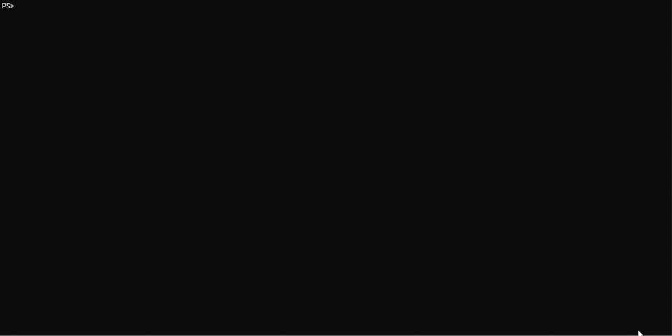
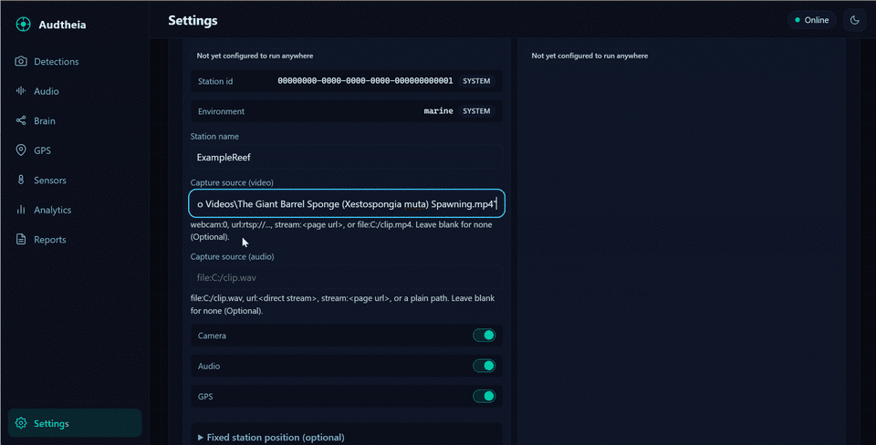
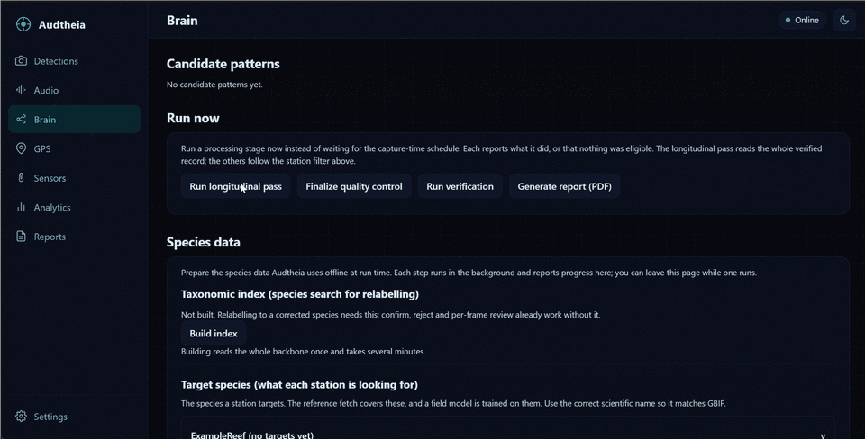
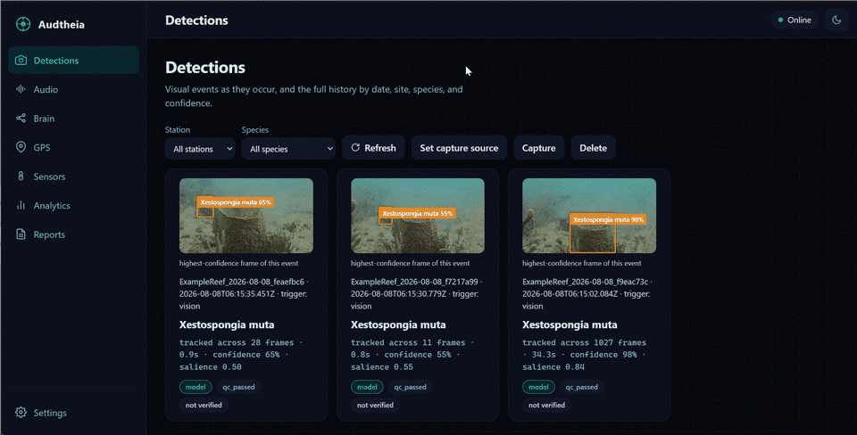

# Audtheia V2

<div align="center">

[](LICENSE)
[](https://www.python.org/downloads/)
[](#system-requirements)
[](#why-it-exists)
[](docs/hardware.md)
[](CHANGELOG.md)
[](https://github.com/AudtheiaOfficial/audtheia-v2/wiki)
[](https://github.com/AudtheiaOfficial/audtheia-v2/stargazers)
[](https://github.com/AudtheiaOfficial/audtheia-v2/network/members)
[](https://github.com/AudtheiaOfficial/audtheia-v2/issues)

</div>


<div align="center">


### Fully offline environmental intelligence for the field

</div>

**A fully offline environmental-intelligence platform for biodiversity monitoring, Marine Protected Area designation support, and longitudinal pattern discovery.**

Audtheia V2 runs on an ordinary personal computer and, when you want a field deployment, connects to one or more Raspberry Pi 5 field stations with a Hailo AI accelerator, deployed in marine, terrestrial, estuarine, or freshwater sites. Once set up, **no internet connection is required at runtime.** A camera or a hydrophone, a field station, and the desktop application are enough to run a rigorous, structured monitoring pipeline anywhere, including the remote, hard-to-reach places where continuous observation is least practical and most needed.

You can also run the entire platform on a single computer with no field hardware at all. That makes it easy to try, to teach with, to compare methods, and to analyze recorded footage, before or instead of building a station.

---

## Two ways to run Audtheia

Audtheia runs the same pipeline in two deployments. Choose the one that fits what you have.

| | Desktop hardware-free mode | Field station |
|---|---|---|
| Where it runs | Any personal computer | A Raspberry Pi 5 in the field, plus your computer as the hub |
| What it watches | A webcam, a network or web-page stream, or a video file | A dedicated camera and, for marine sites, a hydrophone, at a fixed location |
| Detection model | An RF-DETR model (Apache-2.0) run through ONNX Runtime | A detector you train and compile to the accelerator |
| Power | Wall power | Solar and battery, or wall power near shore |
| Best for | Trying the system, teaching, comparing methods, analyzing recordings | Real longitudinal field studies and Marine Protected Area work |

In both modes, detection triggers a complete multimodal observation, quality control finalizes it, the desktop verifies and runs a longitudinal analysis over the record, and reports are generated with every value labeled by its provenance. The field station simply adds real sensors and real, unattended deployment.

## Project status

**Working now, on any computer.** The desktop hardware-free mode captures live from a webcam, a network or web-page stream, or a video file, and runs the full pipeline: detection, object tracking, one-event-per-observation capture, desktop verification, quality control, the longitudinal pass, expert review, and provenance-labeled PDF and CSV reports. This path is covered by the automated test suite.

**Next steps, validating on hardware.** As of today, the field-station capture layer, live audio from a microphone or hydrophone, an I2C environmental sensor bank, a satellite receiver, and on-accelerator detection on the Hailo NPU, are fully implemented against the documented device protocols and unit-tested for scripted hardware backends. It is now entering on-device validation on physical Raspberry Pi 5 and AI HAT+ 2 hardware. Until that validation completes, treat the field-station capture path as functionally complete but not yet field-proven. Field trials and contributions are warmly welcome; see [Contributing to the field station](#contributing-to-the-field-station) and [`docs/field-drivers.md`](docs/field-drivers.md).

**A suggested direction.** Alexandra V. D. Pierre, PhD has suggested a future path toward open, multilingual models, so that reports and community-facing educational fact sheets can reach local communities in their own languages, such as Spanish and French, rather than in English alone.

## Why it exists

Many ecosystems most worth protecting are significantly challenging to observe. Traditional field surveys are limited by what a person can see and how long they can stay, for instance: many species are cryptic, nocturnal, or rare; dense habitats and low light conceal them; skilled fieldwork is costly and hard to sustain; and even careful observers introduce bias. Continuous audio-visual monitoring closes these gaps, watching field sites around the clock and listening to animal calls, catching the crepuscular and nocturnal activity that timed surveys miss, so that even elusive species are detected and counted more reliably, and without the disturbance a human presence might bring. Audtheia was built to put that capability in the hands of a single researcher, a classroom, a small organization, or a protected-area manager, work that would otherwise take a full team on site.

It does that without asking you to give up control of your data. Everything runs on hardware you own. Observations live in a local database on your own computer; nothing is sent to a cloud service, and no credentials leave your machine. The detection code, the analysis code, the database schema, and the desktop application are released under the MIT license, so anyone can deploy it, adapt it to their own species and sites, or build on it.

## Who Audtheia is for

Audtheia is built for people who need a defensible ecological record but may not have a data-engineering team behind them. Everything a study needs is reachable from the interface, so no programming is required to run it. It is also an accessible way for anyone curious about environmental monitoring in the age of edge AI to learn by doing, from a first detection to a finished, provenance-labeled report. The platform makes three distinct subfields of AI tangible and, crucially, keeps them separable and labeled: computer vision, bioacoustics and audio recognition, and a language model (LLM) that, by deliberate design, is constrained to never generate new facts or invent data.

- **Field researchers and graduate students** running longitudinal studies at sites that are remote, hard to reach, or simply too demanding to watch in person around the clock.
- **Marine Protected Area managers** who need continuous, provenance-labeled evidence to support designation, evaluation, reporting, and habitat preservation.
- **Small conservation organizations** that want research-grade monitoring without a cloud subscription or a standing compute budget.
- **Educators and classrooms** using the desktop hardware-free mode to teach visual and acoustic detection, data evaluation, ethical AI practices, and environmental monitoring practices.
- **Anyone re-analyzing recorded footage**, comparing methods, or building a baseline before committing to field hardware.

Typical uses include coral-reef and benthic monitoring, marine megafauna and fish surveys, bird phenology and acoustic monitoring, estuarine and freshwater biodiversity work, and endangered-species presence tracking with conservation status attached to each observation.

## How it works

**Detection is the trigger for everything.** A camera streams continuously into a computer vision model, which screens every frame it can. Nothing is captured on a timer. When the model sees something, or when the acoustic stream hears something, that moment becomes an **event**:

- an object tracker collapses the detected animal across consecutive frames into one event, never one row per frame;
- the event simultaneously captures audio, reads the GPS and every configured environmental sensor, and queries the offline GBIF taxonomic backbone;
- one provenance-tagged, multimodal observation is written to the local database.

To keep storage bounded and a station's power and memory footprint low, an event is saved as the salient frames the model detected rather than as continuous video, and the interface reconstructs a short clip of the event by replaying those frames.

The desktop hub does the heavy, high-accuracy work: it re-verifies every detection with a second, larger model (RF-DETR through ONNX Runtime), owns all ecological interpretation, runs a longitudinal pattern-discovery pass over the verified record, generates reports, and holds the authoritative database. **Only reports and the pattern pass run on a schedule;** everything else is driven by what actually happens in front of the sensor.

## The scientific guarantee

Trust in a dataset comes from knowing where every number originated from, and Audtheia keeps that record for you. Every value the system stores carries a provenance tag and a quality-control status. A number a sensor measured, a value looked up from a reference database, a model's classification, an interpretation inferred downstream, and a candidate pattern proposed by the longitudinal pass all remain permanently distinguishable. The database makes it structurally impossible to blur measured fact with inference. Furthermore, marine sensor channels carry a QARTOD quality flag, the standard oceanographic scale of pass, not evaluated, suspect, fail, or missing, so a questionable reading is marked as such rather than trusted silently. Interpretation and pattern discovery live on the far side of that firewall, always labeled, always traceable back to the confirmed detections that produced them. The goal is a research-grade, FAIR-defensible record a scientist can stand behind.

---

## System requirements

**Desktop hub (required).** Any reasonably modern computer running Windows, macOS, or Linux, with Python 3.11 or newer. No GPU is required, the desktop verifier runs on ONNX Runtime and works on the CPU, though a supported GPU speeds it up. Allow several gigabytes of free disk for the offline GBIF taxonomic backbone and the models, which setup downloads once. After setup, no internet connection is needed to run the platform; a network is used only to reach a field station and, at setup time, to fetch species reference data.

**Field station (optional).** A Raspberry Pi 5 running Raspberry Pi OS (64-bit, Bookworm or newer) with the Raspberry Pi AI HAT+ 2 and its Hailo accelerator, a camera, and, for underwater sites, a hydrophone, plus the environmental sensors your site needs. Field stations run on solar and battery, or on wall power near shore. The exact parts, reference builds, and the power-and-solar budget method are in the [hardware guide](docs/hardware.md).

## Getting started

By the end of this section your computer will be running the Audtheia application, ready to connect a field station or to capture directly with no hardware. No programming experience is required.

<div align="center">
  
  <p><em>From a fresh clone to the Audtheia desktop app: clone, run setup once, and launch.</em></p>
</div>

### Before you begin

You need two things installed:

- **Python 3.11 or newer.** Raspberry Pi OS Bookworm already includes it. On Windows and macOS, install it from [python.org](https://www.python.org/downloads/) if you do not have it.
- **Git**, to download the project.

### Step 1: Download Audtheia

Open a terminal (on Windows, use Command Prompt or PowerShell) and run:

```
git clone https://github.com/AudtheiaOfficial/audtheia-v2.git
cd audtheia-v2
```

### Step 2: Run setup once

Setup creates an isolated environment, installs the pinned dependencies, creates the local database, prepares a credentials file, and downloads the base models. It is safe to run more than once.

```
./scripts/setup.sh          # Linux, macOS, Raspberry Pi OS
scripts\setup.bat           # Windows
```

When it finishes, it prints a short summary, including any model it could not download automatically and where to place it by hand.

### Step 3: Launch the application

Audtheia runs as a desktop application in its own window. The first time only, add the window component; after that the app launcher opens it directly:

```
scripts\start-app.bat --install-window        # Windows
./scripts/start-app.sh --install-window        # Linux, macOS
```

From then on, launch it with the app launcher alone (or just double-click it):

```
scripts\start-app.bat          # Windows
./scripts/start-app.command    # macOS (or double-click it in Finder)
./scripts/start-app.sh         # Linux
```

This opens Audtheia in its own window using your system's built-in web view (Edge WebView2 on Windows, WebKit on macOS), so it looks and behaves like a normal application rather than a browser tab.

**Prefer a browser tab instead?** The plain launcher serves the same interface and offers to open it in your browser at `http://127.0.0.1:8000`:

```
scripts\start.bat           # Windows
./scripts/start.command     # macOS
./scripts/start.sh          # Linux
```

Either way, the launcher starts the local server and waits until it answers; there is no terminal interaction after this.

> **Note:** launching the app opens the interface. To actually capture and analyze on your own computer with no field hardware, see [Running the desktop hardware-free mode](#running-the-desktop-hardware-free-mode) below. You can start it right from the Detections panel, or with a single command.

## Running the desktop hardware-free mode

You do not need any field hardware to use Audtheia. In this mode your computer watches an ordinary video source and runs the whole pipeline itself, detecting, verifying, analyzing, and reporting, exactly as a field station would.

<div align="center">
  
  <p><em>Set a video source, start capture, and watch labeled detections appear, each with its confidence, salience, and provenance.</em></p>
</div>

Everything is ready out of the box. The reference setup already includes a detection model and its species names, so there are only two things to do: pick what to watch, and start.

### Step 1: Choose what to watch

Tell a station where its video comes from. You can set this in the app under **Detections, Set capture source**, or in the settings file under `capture.source.video`. Any of these work:

- `webcam:0` for a connected camera (use `webcam:1` for a second one);
- `url:rtsp://...` or `url:https://...m3u8` for a direct camera or streaming address;
- `stream:https://...` for a public web-page live stream, such as a wildlife camera page, found automatically;
- `file:/path/to/clip.mp4` for a video file on your computer.

The reference setup ships a station already set to `webcam:0`, so you can start right away.

### Step 2: Start capturing

Open **Detections**, set your source, then press **Capture** and **Start**. Detections appear below as they happen, each with its frame and species label, exactly as in the demo above. Press Start again to stop. That is all it takes.

---

**Two optional extras.** The reference model recognizes marine sponges; to detect other species, add your own model (the [custom models guide](docs/custom-models.md) covers it). And if you would rather run everything unattended from a terminal instead of pressing Start, one command does it all, capture, verification, the longitudinal analysis, reports, and the interface:

```
scripts\run-desktop.bat     # Windows
./scripts/run-desktop.sh    # Linux, macOS, Raspberry Pi OS
```

Add `--once` to run through a single video file and then stop.

## Connecting a field station

A field station is a Raspberry Pi 5 with the AI HAT+ 2, a camera, and the sensors your site needs. Building one is described in the [hardware guide](docs/hardware.md), and preparing its detection model in the [custom models guide](docs/custom-models.md).

Once the hardware is assembled:

1. Flash the Pi with Raspberry Pi OS (64-bit, Bookworm or newer) using Raspberry Pi Imager, with SSH and Wi-Fi enabled, and boot it on the same network as your computer.
2. From your computer, provision it over the network:

   ```
   ./scripts/connect-pi.sh --station-id <id> --host <pi-address> --user <pi-user>
   connect-pi.bat --station-id <id> --host <pi-address> --user <pi-user>
   ```

   Add `--dry-run` to preview every action without contacting a Pi.

This sends the code, the station's configuration and models, and its network settings to the Pi, sets up its environment, initializes its local store, brings up its Wi-Fi hotspot for local access, and installs the service that keeps it running across reboots. From then on the station operates independently, capturing to its own local store. In the field with no internet, it broadcasts its own network named after the station.

Bringing a station's captured record across to the desktop uses the append-only station-to-desktop sync, and it is implemented. The desktop pulls a reachable station over SSH: the station exports its unconfirmed rows, the desktop imports them and fetches the frames and clips they reference, and the station marks them confirmed, so a sync can never overwrite a desktop-owned value and an interrupted pull is safe to resume. It runs automatically whenever a connected station is reachable, and a **Sync now** control in Settings triggers a pull on demand. The SSH and scp transport awaits validation on real hardware (see [Project status](#project-status)); the sync logic is covered by tests. Once a station's records are on the desktop, you review everything, the detections, audio, sensors, GPS, and reports, in the desktop application.

A station-local live interface served over that hotspot, so you can open the station's own address from a phone or laptop in the field and watch live detections and sensor readings, is part of the field-station work now entering on-device validation (see [Project status](#project-status)). Today the desktop application is where a station's record is reviewed.

## Setting up species names and conservation status

Two one-time steps prepare the species data Audtheia uses offline at run time. Both are guided actions in the interface, under **Brain, Species data**, so neither needs a command line; each runs in the background and shows its progress, and you can leave the page while one runs.

<div align="center">
  
  <p><em>Building the offline taxonomic index, then fetching each species' GBIF and IUCN reference data, from the Brain panel.</em></p>
</div>

- **Build the taxonomic index.** Relabelling a detection to a corrected species searches a prebuilt index of the shipped GBIF backbone. Building it reads the backbone once and takes several minutes. Confirming a detection, rejecting it, and marking individual frames accurate or inaccurate need no index and work without it; only relabelling to a searched species depends on it.
- **Fetch reference data.** For each of your stations' target species, Audtheia fetches the GBIF taxonomic match, the GBIF global occurrence count, and, when a token is present, the IUCN Red List category, and caches them locally with the fetch date stamped on every dependent record. New captures then carry a snapshot date, so the "Model and data versions" panel discloses how current its taxonomy and status data is.

Only one credential matters, and only for one field. GBIF naming and the occurrence count are public and need no account, so the IUCN token is the only credential that changes anything: it adds the Red List conservation status. Put an IUCN token in `config/secrets.json` (setup created it from a template) to fill that field; without it, everything else still fetches and the status is left blank and reported as such.

Both steps are also available from the command line for an unattended setup: `python scripts/build_gbif_index.py` builds the index, and `./scripts/fetch-species-data.sh` (or `scripts\fetch-species-data.bat`) fetches the reference data.

## Using the interface

The interface is a browser-based application served locally by the device, with all assets bundled so it loads with no internet.

<div align="center">
  
  <p><em>A quick tour of the sidebar: detections, audio, the Brain, the map, analytics, reports, and settings.</em></p>
</div>

The sidebar keeps things organized:

- **Detections**: the live feed and the browsable history, each observation shown as an event card with its frames, labels, audio, location, sensor readings, quality flags, and the desktop verification result.
- **Audio**: acoustic detections and playable clips, with the active acoustic model shown.
- **Brain**: three areas, the models and their accumulated memory; learning, fine-tuning, and audit logs; and reusable skills that add site-specific rules.
- **GPS**: the map of detection locations, survey paths, and site boundaries.
- **Analytics**: species richness over time, environmental trends, diversity metrics, and anomaly flags surfaced as candidate patterns.
- **Reports**: scheduled and on-demand PDF and CSV reports, every value labeled by its provenance and its data source disclosed.
- **Settings**: color scheme, station management, sensor and capture configuration, the capture source, model paths, schedules, credentials, and a built-in guide.

## Configuration

Everything that varies between deployments lives in `config/settings.json`, never in code: the stations and their sensors, the model paths, the capture tuning, the desktop capture source, the report and longitudinal-pass schedules, and the display time zone. Timestamps are always stored in coordinated universal time and localized only for display. Every setting is documented with examples in `config/README.md`.

## Troubleshooting

- **Setup stops on a package.** The message names the package and the reason. The most common cause is an older Python; Audtheia needs 3.11 or newer. Install a current Python and run setup again.
- **The generative model did not install.** This is not fatal. The desktop still runs, and the longitudinal pass still discovers and records its patterns; the language model only adds richer interpretation and can be installed later.
- **The desktop mode records no detections.** Confirm a detection model is present at the path the station's desktop model setting names, and that the capture source opens (a wrong camera index, stream address, or file path is the usual cause). The [custom models guide](docs/custom-models.md) covers obtaining a model.
- **A field station is not reachable.** Confirm it is on the same network, that SSH was enabled when you flashed it, and that the address and user you passed are correct. Use `--dry-run` to check the steps without contacting the Pi.
- **A named time zone does not resolve on Windows.** Windows does not ship the time-zone database; install it with `pip install tzdata`, or leave the time zone set to automatic, which needs nothing.

## Repository structure

```
audtheia-v2/
├── audtheia/
│   ├── config.py            validating settings loader
│   ├── pipeline/            capture runtime: monitor, acoustic, environment, composer, drivers (desktop capture)
│   ├── analysis/            observation (deterministic QC), verify (RF-DETR), dream (longitudinal pass)
│   ├── inference/           concrete desktop model adapters (RF-DETR ONNX verifier)
│   ├── reports/             provenance-labeled PDF and CSV
│   ├── storage/             schema.sql, database.py
│   └── app/                 server (FastAPI) + static interface, orchestrator (desktop station)
├── models/                  visual, acoustic, and language models (fetched or placed, not committed)
├── config/                  settings.json, model_sources.json, secrets template, README
├── scripts/                 setup, connect-pi, fetch-species-data, start, run-desktop (each .sh/.command/.bat)
├── tests/                   unit and integration tests, all on mocked hardware
├── docs/                    hardware, custom-models, dream-pass guides
└── requirements.txt · requirements-dev.txt · requirements-pi.txt · LICENSE
```

## Documentation

- [Hardware guide](docs/hardware.md): the parts, the reference builds, the power-and-solar budget method, and the camera anti-fouling plan.
- [Custom models guide](docs/custom-models.md): training your own detectors, compiling a field model to the accelerator, exporting the desktop model, and training acoustic classifiers.
- [Dream pass guide](docs/dream-pass.md): how the longitudinal analysis works and how to read its candidate hypotheses.

## Applications and impact

Because it turns continuous observation into a structured, provenance-labeled record, Audtheia is suited to work that traditional surveys struggle to sustain.

- **Marine Protected Area monitoring and compliance.** Continuous, defensible baselines and time series that support designation, evaluation, and reporting against conservation frameworks, with every figure traceable to the detections behind it.
- **Research on elusive, nocturnal, and rare species.** Around-the-clock audio-visual capture surfaces the crepuscular and nocturnal activity and hard-to-see taxa that timed transects miss, and paired environmental sensors relate that activity to the conditions driving it.
- **Education and edge-AI training.** A hands-on way to learn environmental monitoring and on-device AI from end to end, from a first detection to a finished report, with no programming required.
- **Expert-in-the-loop science and FAIR data.** Reviewers confirm, reject, or relabel detections to fine-tune models and audit results; captured frames export as ready-to-correct training packages; and the record follows FAIR and comparable scientific guidelines (Findable, Accessible, Interoperable, and Reusable), feeding both report generation and the longitudinal pass that surfaces trends, correlations, and co-occurrences across a site over time.

## Relationship to Audtheia V1

Audtheia V2 builds on the earlier Audtheia monitoring platform, [Audtheia V1](https://audtheiaofficial.github.io/audtheia-environmental-monitoring/index.html), which remains available and unchanged. V1 is a cloud-connected system that processes video in real time while specialized AI agents perform deep ecological analysis in parallel, storing research-grade observations and generating professional PDF reports; its [website](https://audtheiaofficial.github.io/audtheia-environmental-monitoring/index.html) hosts a live demo, a researcher dashboard, and full documentation. V2 is a fresh, fully offline redesign in its own repository. The marine-sponge detection model from V1, the [Official Porifera Classifier](https://universe.roboflow.com/marine-sciences-research-station/official-porifera-classifier-ju8er) on Roboflow Universe, carries forward here as the default desktop verification model, so earlier work continues to apply.

## Contributing to the field station

Audtheia's field-station architecture is complete and the desktop platform is ready to pair with it; what remains is validating the hardware driver layer on physical devices and running real deployments. If you work with the Raspberry Pi 5 and the AI HAT+ 2, with environmental sensors, hydrophones, or GPS receivers, or you are planning a marine, terrestrial, estuarine, or freshwater deployment, your help would be genuinely valuable and gratefully credited.

Especially welcome:

- **On-device validation of the field drivers.** The live audio source, the I2C environmental sensor bank, the NMEA satellite receiver, and the Hailo accelerator detector each plug into a stable seam and need confirming against real hardware. The drivers and a step-by-step validation checklist are in [`docs/field-drivers.md`](docs/field-drivers.md); the code is [`audtheia/pipeline/field_drivers.py`](audtheia/pipeline/field_drivers.py).
- **Building and compiling a detector to the accelerator**, following the [custom models guide](docs/custom-models.md), on the [reference hardware](docs/hardware.md).
- **Real field trials and the notes that come out of them**, following the [field deployment checklist](docs/field-deployment-checklist.md).

The best place to start is a [GitHub issue or discussion](https://github.com/AudtheiaOfficial/audtheia-v2/issues): say hello, and we will find the right first step together. Please also read [`CONTRIBUTING.md`](CONTRIBUTING.md) for the design rules a contribution keeps.

## Citation

If you use Audtheia V2 in your research, please cite it. A machine-readable [`CITATION.cff`](CITATION.cff) is included; GitHub renders a "Cite this repository" button from it. A DOI will be added here and in the citation file at the first tagged release.

```bibtex
@software{audtheia_v2,
  author  = {Portalatin, Andy},
  title   = {Audtheia V2: A Fully Offline Environmental-Intelligence Platform},
  year    = {2026},
  version = {2.0.0},
  url     = {https://github.com/AudtheiaOfficial/audtheia-v2}
}
```

## License

Released under the MIT license. Copyright 2026 Andy Portalatin. See [LICENSE](LICENSE).

## Acknowledgments

Audtheia V2 stands on open scientific data and open-source software.

- **[GBIF](https://www.gbif.org/)**, the Global Biodiversity Information Facility, for the taxonomic backbone and occurrence data, used under CC BY 4.0.
- **[IUCN Red List](https://www.iucnredlist.org/)** for conservation-status data, fetched under the user's own credentials.
- **[BirdNET](https://github.com/birdnet-team/BirdNET-Analyzer)** for avian and terrestrial acoustic recognition. Its analyzer code is MIT-licensed; its models are provided under CC BY-NC-SA 4.0, under which research and educational use is treated as non-commercial.
- **[RF-DETR](https://github.com/roboflow/rf-detr)** (Apache-2.0), the transformer detection architecture used for high-accuracy desktop verification through ONNX Runtime.
- **[ONNX Runtime](https://onnxruntime.ai/)**, **[llama.cpp](https://github.com/ggml-org/llama.cpp)** for on-device language-model inference, and **[FastAPI](https://fastapi.tiangolo.com/)** and **[Uvicorn](https://www.uvicorn.org/)** for the local application server.

**Advisory.** The direction of building Audtheia as a fully offline, freely usable educational tool was encouraged by the guidance of Alexandra V. D. Pierre, PhD, whose support is gratefully acknowledged.

Thanks to the marine biology, acoustic monitoring, and conservation communities whose feedback shaped the platform.

**Demo footage.** The wildlife footage in these demonstrations is shown for illustration, with gratitude to the videographers. The Carolina Chickadee footage in the overview animation is by [Navarre's Wild Shots](https://www.youtube.com/watch?v=I4OUdQR3oTQ); the desktop hardware-free demonstration uses *The Giant Barrel Sponge (Xestospongia muta) Spawning* by [Shane Wever](https://www.youtube.com/@shanewever).

## Contact

Questions, bug reports, and feature requests go through **[GitHub Issues](https://github.com/AudtheiaOfficial/audtheia-v2/issues)**. Please search existing issues before opening a new one, and see [CONTRIBUTING.md](CONTRIBUTING.md) for how to report effectively.

---

<div align="center">

Made with 💚 for the scientific community.

</div>
